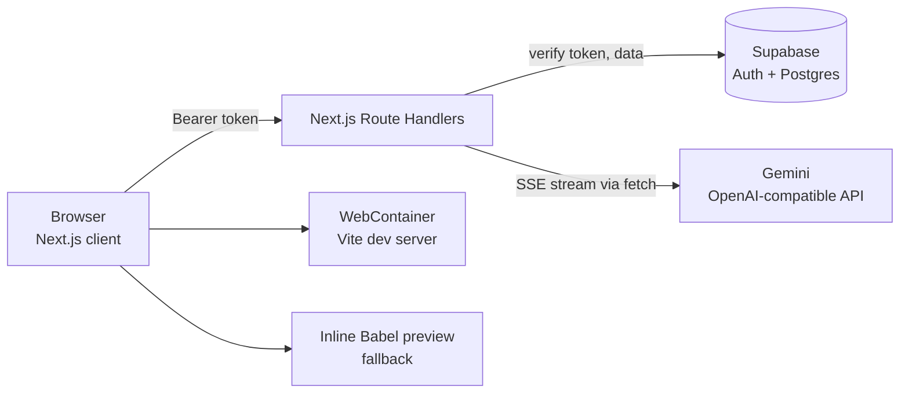

# Forgely

**Describe your app. Watch it come to life.**

Forgely is an AI app builder. You type what you want in plain English, and it streams back a working **Vite + React + TypeScript + Tailwind** front end. You can then preview it live, edit the code in the browser, refine it by chatting, and roll back through version history or download the project as a ZIP.

> Generated apps are **frontend-only**. If you ask for a backend feature (auth, database, API), the AI mocks it with React state and sample data.

---

## Table of contents

- [Features](#features)
- [Tech stack](#tech-stack)
- [Architecture](#architecture)
- [Getting started](#getting-started)
- [Environment variables](#environment-variables)
- [Database setup](#database-setup)
- [Authentication setup](#authentication-setup)
- [Scripts](#scripts)
- [Running with Docker](#running-with-docker)
- [Project structure](#project-structure)
- [How generation works](#how-generation-works)
- [Credits and rate limits](#credits-and-rate-limits)
- [API reference](#api-reference)
- [Deployment](#deployment)
- [Troubleshooting](#troubleshooting)
- [Security notes](#security-notes)
- [Known limitations](#known-limitations)
- [Documentation](#documentation)
- [License](#license)

---

## Features

**Building**
- Prompt-to-app generation, streamed live into the editor
- Follow-up prompts that edit the existing app, with conversation context
- Automatic retry when the AI response is cut off, so a broken app is never saved
- Split workspace: file explorer, Monaco code editor, live preview and terminal
- In-browser runtime using WebContainers, with an inline Babel + Tailwind preview as a fallback
- Keyboard shortcuts: `Ctrl/Cmd + S` to save, `Ctrl/Cmd + Z` to undo

**Projects**
- Dashboard with create, rename and delete
- Multi-tab workspace that remembers your open projects
- Version history with diff view and one-click restore (a restore creates a new version, so nothing is lost)
- Undo for the last AI change
- Download any project as a ZIP

**Accounts and usage**
- Supabase auth: email/password and Google OAuth
- Protected routes for the dashboard and projects
- Credit system: 1 credit per generation, with refunds on failure and a live balance badge
- Per-user rate limiting

---

## Tech stack

| Layer | Technology |
|---|---|
| Framework | Next.js 14 (App Router), React 18, TypeScript |
| Styling and motion | Tailwind CSS, Framer Motion, Sonner (toasts), Lucide icons |
| Editor and runtime | Monaco Editor, WebContainers (`@webcontainer/api`), xterm, Sandpack |
| Auth and database | Supabase (Postgres, Auth, row-level security) |
| AI | Google Gemini through its OpenAI-compatible endpoint |
| Packaging | Docker (Next.js standalone output), Vercel |

---

## Architecture



- The browser signs in with Supabase and sends the access token to the API routes.
- The API routes use the Supabase service-role key, so **every route checks project ownership itself**.
- The model output is streamed back to the browser, parsed into files, and mounted in a WebContainer (or the fallback preview).

---

## Getting started

### Prerequisites

- **Node.js 18.17 or later** (Node 20 recommended)
- A **[Supabase](https://supabase.com)** project (the free tier works)
- A **[Google AI Studio](https://aistudio.google.com)** API key for Gemini
- A Chromium-based browser for the full WebContainer experience (other browsers use the fallback preview)

### Install and run

```bash
git clone https://github.com/kiran-rachel-george/forgely
cd forgely
npm install
cp .env.example .env.local     # then fill in the values (see below)
npm run dev
```

Open <http://localhost:3000>. You will be redirected to `/login`. Create an account at `/signup`.

Before the first run, complete [Database setup](#database-setup) and [Authentication setup](#authentication-setup).

---

## Environment variables

Copy `.env.example` to `.env.local` and fill in:

| Variable | Required | Description |
|---|---|---|
| `NEXT_PUBLIC_SUPABASE_URL` | Yes | Supabase project URL (Settings, then API) |
| `NEXT_PUBLIC_SUPABASE_ANON_KEY` | Yes | Supabase anon / public key |
| `SUPABASE_SERVICE_ROLE_KEY` | Yes | Service-role key. **Server only. Never expose it to the browser or commit it.** |
| `GEMINI_API_KEY` | Yes | Gemini API key used by `/api/generate` |
| `OPENAI_MODEL` | No | Model name. Defaults to `gemini-3.6-flash`. |
| `MAX_OUTPUT_TOKENS` | No | Maximum tokens per generation. Defaults to `60000`. Lower it if your model rejects that value. |
| `NEXT_PUBLIC_APP_URL` | No | Public base URL used for auth redirects. Defaults to the browser origin. |

`NEXT_PUBLIC_*` values are inlined at build time. After changing `.env.local`, **restart** the dev server.

---

## Database setup

1. Open your Supabase project, then the **SQL Editor**.
2. Paste the whole of [`supabase/schema.sql`](supabase/schema.sql) and run it. It is safe to run more than once.

It creates:

| Table | Purpose |
|---|---|
| `users` | Profile, `credits` (default 10) and `plan` |
| `workspaces` | Reserved for team features (not used in the UI yet) |
| `projects` | One row per app |
| `versions` | Every generated or saved version of a project's code |
| `messages` | Chat history per project |

The script also adds indexes, an `updated_at` trigger on `projects`, and row-level security policies so each user can only access their own rows.

---

## Authentication setup

In the Supabase dashboard:

1. **Authentication, then URL Configuration:** set the Site URL to your app URL (`http://localhost:3000` locally) and add `<app-url>/auth/callback` to the redirect URLs.
2. **Authentication, then Providers, then Email:** turn **Confirm email** off for local development, or confirm the email link after signing up.
3. **Google sign-in (optional):** enable the Google provider and add its client ID and secret.

---

## Scripts

| Command | What it does |
|---|---|
| `npm run dev` | Start the development server on port 3000 |
| `npm run build` | Create a production build |
| `npm run start` | Serve the production build |
| `npm run lint` | Run ESLint |

---

## Running with Docker

```bash
docker compose up --build
```

The image uses Next.js standalone output and listens on port 3000. Because `NEXT_PUBLIC_*` variables are inlined when the app is **built**, they must be available at build time (as build args), not only at runtime. The server-only variables (`SUPABASE_SERVICE_ROLE_KEY`, `GEMINI_API_KEY`) are read at runtime from `.env`.

---

## Project structure

```
src/
  app/
    api/
      generate/            POST  streaming AI generation
      profile/             GET   credits and plan
      profile/sync/        POST  upsert the profile row after login
      projects/            project, version and message endpoints
    auth/callback/         OAuth code exchange
    dashboard/  login/  signup/  project/[id]/
  components/
    builder/               editor, preview, chat, version history, file explorer
    dashboard/ landing/ layout/ topbar/ modals/ ui/
  hooks/                   useChat, useCredits, useProject, useWebContainer, ...
  lib/
    openai.ts              streaming Gemini client
    credits.ts             atomic credit deduction and refund
    rate-limit.ts          per-user rate limit and lock
    file-converter.ts      parses AI output into project files
    constants.ts           system prompt and starter files
    supabase*.ts           browser and server Supabase clients
middleware.ts              route protection, COOP/COEP headers
supabase/schema.sql        database schema and RLS
```

---

## How generation works

1. The browser sends `{ projectId, prompt, previousFiles, messages }` to `POST /api/generate` with the user's access token.
2. The server verifies the user, checks the rate limit and project ownership, and **takes one credit**.
3. It builds the prompt from the system prompt, recent chat history and the current `src/` files, and streams the request to Gemini.
4. Tokens are streamed straight back to the browser as they arrive.
5. When the stream ends, the server checks that every `<<<FILE:...>>>` block has its `<<<END_FILE>>>`. If the response was cut off, it **retries up to 3 times**, telling the client to discard the partial text each time.
6. A complete response is saved as a new `versions` row, along with the chat messages. If nothing could be saved, the credit is refunded.
7. The browser parses the file blocks (`src/lib/file-converter.ts`) and mounts them in the WebContainer or the fallback preview.

The model replies in a plain-text delimited format (`<<<PLAN>>>`, `<<<FILE:path>>>`, `<<<DEPENDENCIES>>>`), not JSON, so file contents never need escaping.

---

## Credits and rate limits

| Rule | Value |
|---|---|
| Starting balance | 10 credits per new user (`users.credits`) |
| Cost | 1 credit per generation. Retries inside one request cost nothing extra. |
| Refund | Automatic if the generation fails or cannot be saved |
| Empty balance | Request rejected with HTTP 402 |
| Rate limit | 6 requests per minute per user (HTTP 429) |
| Concurrency | One generation at a time per user (HTTP 429) |
| Prompt size | 4,000 characters |
| Request size | 4 MB |

The balance is shown as a badge in the dashboard and the workspace. The rate limit and lock are kept in server memory, which is fine for one server. On a multi-instance host such as Vercel, move them to a shared store like Upstash Redis.

To add credits manually, edit `users.credits` for the user in the Supabase table editor.

---

## API reference

All routes need `Authorization: Bearer <access token>` (or the `sb-access-token` cookie) unless noted.

| Method and path | Description |
|---|---|
| `POST /api/generate` | Stream a generation. Returns plain text. Errors: 401, 402, 404, 413, 429. |
| `GET /api/profile` | `{ credits, plan }` for the current user |
| `POST /api/profile/sync` | Create or update the profile row |
| `GET /api/projects` | List projects with their latest version |
| `POST /api/projects` | Create a project with the starter scaffold |
| `GET /api/projects/:id` | Project with all versions and messages |
| `PATCH /api/projects/:id` | Rename a project |
| `DELETE /api/projects/:id` | Delete a project |
| `GET /api/projects/:id/versions` | List versions |
| `POST /api/projects/:id/versions` | Save a manual version |
| `POST /api/projects/:id/versions/:versionId/restore` | Restore a version as a new one |
| `GET /api/projects/:id/messages` | List chat messages |
| `POST /api/projects/:id/messages` | Add a chat message |
| `GET /auth/callback` | OAuth callback (no bearer token) |

---

## Deployment

**Vercel (recommended)**

1. Import the repository into Vercel.
2. Add the environment variables from the table above.
3. Add your production URL to Supabase's redirect URLs, and set `NEXT_PUBLIC_APP_URL`.
4. Deploy. Project pages are served with the `Cross-Origin-Opener-Policy` and `Cross-Origin-Embedder-Policy` headers that WebContainers require (see `next.config.mjs` and `middleware.ts`).

**Docker or any Node host:** see [Running with Docker](#running-with-docker).

---

## Troubleshooting

| Symptom | Cause and fix |
|---|---|
| "Failed to fetch" on login or signup | The Supabase project is unreachable. Free projects are paused after inactivity. Restore it in the Supabase dashboard, and check `NEXT_PUBLIC_SUPABASE_URL`. |
| Redirected to `/login` after signing in | The auth cookie is not set. Check the Site URL and redirect URLs in Supabase. |
| "You have no credits left" | Balance is 0. Raise `users.credits` in Supabase. |
| "The AI response was cut off" | All 3 attempts returned incomplete output. Try a shorter or simpler prompt. The server log shows each attempt's finish reason. |
| Preview error about JSX or syntax | The saved version is broken. Restore an earlier version from version history and retry. |
| Blank preview or no WebContainer | Needs a Chromium browser and cross-origin isolation. The app falls back to the inline preview automatically. |
| Env changes have no effect | Restart `npm run dev`. |
| Table not found after login | Run `supabase/schema.sql` in the Supabase SQL editor. |

---

## Security notes

- Never commit `.env.local` or the service-role key. `.env.local` is git-ignored.
- The API uses the service-role key, which bypasses row-level security, so each route must check ownership. Keep `ensureProjectOwnership` in every project route.
- Auth tokens are currently stored in cookies readable by JavaScript. Moving to `httpOnly` cookies with `@supabase/ssr` is planned (see the PRD).
- Generated code runs in the user's browser (WebContainer or a blob iframe), not on your server.

---

## Known limitations

- The **Deploy** button has no action yet, and there is no payment flow, so the pricing page and Buy Credits button are placeholders.
- Credit balances do not update live across open tabs.
- The rate limit is per server instance.
- There are no automated tests yet.
- There is no password-reset page yet.

See [`PRD.md`](PRD.md) for the roadmap.

---

## Documentation

- [`PRD.md`](PRD.md): product requirements and roadmap
- [`supabase/schema.sql`](supabase/schema.sql): database schema

---

## License

Released under the [MIT License](LICENSE).
